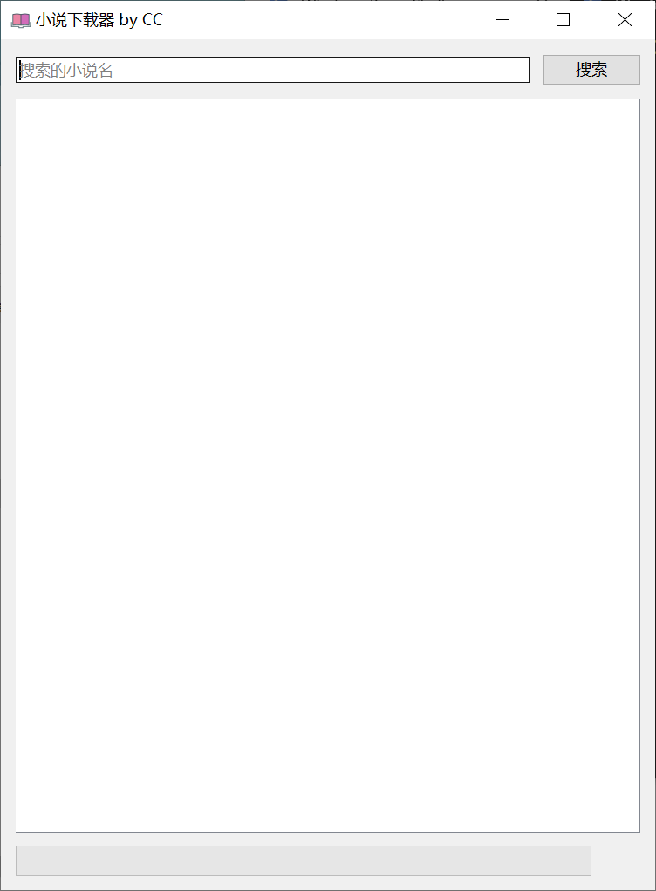
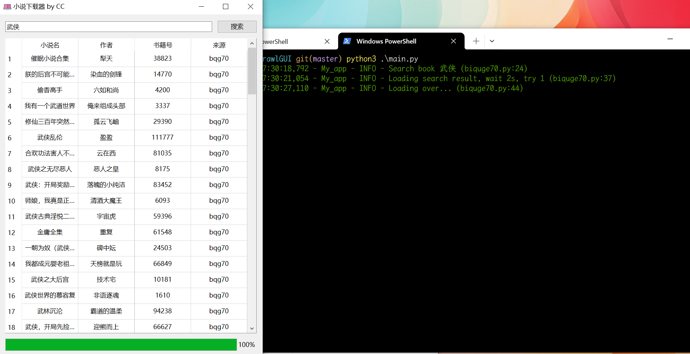
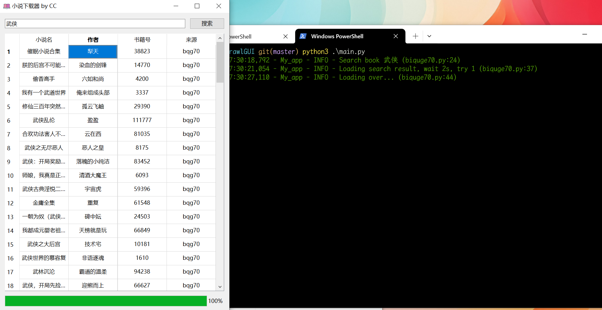
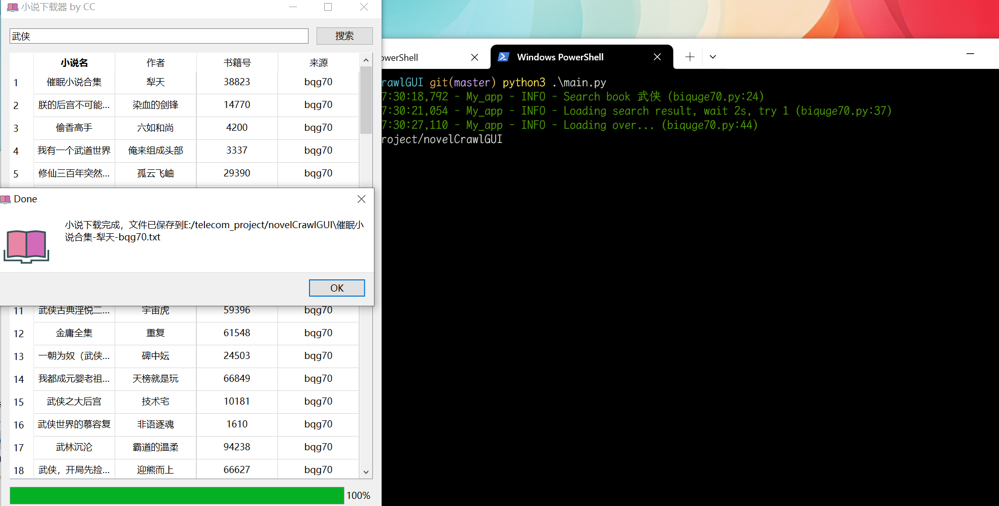

# 爬取小说(界面)

## 安装

### 可执行文件

从[release](https://github.com/cmacckk/novelCrawlGUI/releases)下载对应系统版本文件，直接运行即可

### 源码运行

```bash
python3 -m pip install -r requirements.txt
python3 main.py
```

## 界面









## 命令行版本

[CLI版本地址](https://github.com/cmacckk/novelCrawl)

## 声明
该软件仅供学习使用 请勿用于非法用途